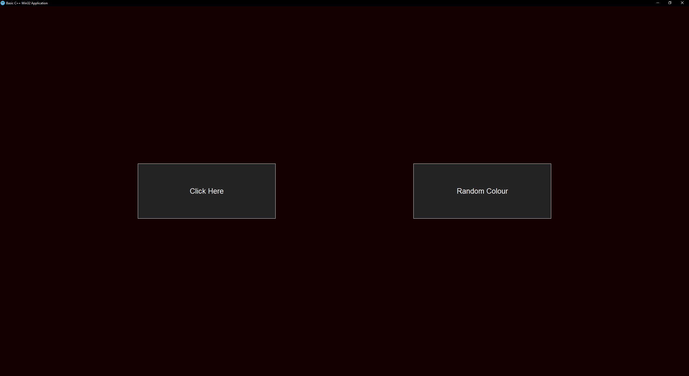

# Basic_Win64_Application

<b><u>
 Image of Project Main Window 
</u></b>

</img>

## Description
A low level program, developed using C++ Version 23 (C++ 23), it's a really low level implementation, as it uses no non-standard C++ libraries apart "windows.h" header for Windows API development, however it may use GDI under Window's interface, 
Program utilises the Windows's API (WIN32/WIN64) to display a window with two buttons that lead to either random colour action on background or open a child window.

### IDE, Compiler and other tools
-<b> CLion IDE:</b> Written source code with it, built x64 release binary executable  
-<b> Visual Studio 2022 Community:</b> Profiling tools to fix memory leaks, instances monitoring and heap/stack analysing  
-<b> CMake:</b> Build tool for the program  
-<b> G++:</b> Compiler for program  

## Demo Video

## Newly acquired expertise from project
- Windows's API (Win32/Win64) Functions and implementation at low level
- Using C++ at Intermediate level
- Low level programming & graphics
- Usage of CMake
- Memory Addresses, Pointers & Allocation
- Profiling for memory leaks, instance, heap & stack monitoring
- Refined OOP design patterns, such as encapsulation

## Compiling/Build Instructions
1. Clone the repository running the command:  `https://github.com/DevPinda/Basic_Win32_Application.git`  , under Git Bash in your chosen directory to clone the repo from remote to your local machine.
2. Open the repo folder with an IDE that supports CMake projects and C++ 23; I recommend to use CLion as the IDE to compile/builld the source code, however Visual Studio needs the following workloads in order to function effectively: Desktop development with C++ alongside Linux and embedded development with C++.  
3. If given option of a compiler, utilise Mingw as it includes the G++ compiler to compile the source code.
4. If given option of build tools, then utilise CMake to build a debug or release build.
5. Do not use Mingw as release or build type, instead use the x64 binary release (recommended).
6. Open main.cpp as WinMain is the entry point of the program, and then click on either the run, debug or build buttons on the IDE to perform your wanted action.  
 <b>!! Warning !! : I have experienced Visual Studio to crash if the required workloads aren't installed, (I initially installed Desktop development with C++ alone, so without Linux and embedded development with C++, Visual Studio froze), however when the IDE's are properly set-up the program should compile and build correctly.</b> 
 <b>!! Warning !! : Building under Visual Studio gave missing DLL errors upon .exe execution on a fresh Windows env., on the other hand CLion properly bundled required DLL/links within the release file without issues; CLion's x64 release worked even under both Linux and MacOS using WINE compatibility layer.</b>

## Contributors
Parminder Singh (DevPinda) {Me} 
